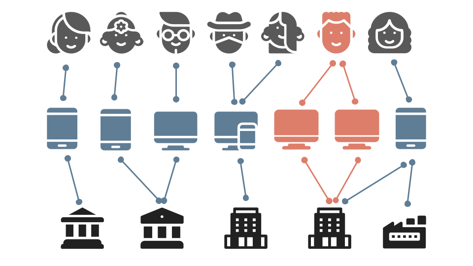
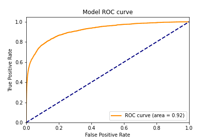

# Fraud Detection in Graph Neural Network

This repo is refactored from the model used in [awslabs/sagemaker-graph-fraud-detection](https://github.com/awslabs/sagemaker-graph-fraud-detection), and implemented based on [Deep Graph Library](https://github.com/dmlc/dgl) (DGL) and PyTorch. Unlike Amazon's implementation, this repo does not require the use of Sagemaker for training. We can run it directly with the free [Google Colab](https://colab.research.google.com/) or with our own local devices.

In addition to the Fraud transaction detection problem addressed, the repo can also be used in other heterogeneous graph based scenarios, such as game account theft, online shopping fraudulent orders, etc.

## Introduction

Many online businesses lose billions of dollars to fraud each year, but machine learning-based fraud detection models can help businesses predict which interactions or users are likely to be fraudulent in order to reduce losses.

This repo formulates the problem of fraud detection as a classification task for heterogeneous interaction networks. The machine learning model used is a graphical neural network (GNN) that learns potential representations of users or transactions, which can then be easily classified as Fraud or not.

This repo constructs a heterogeneous graph of the transaction data provided in the [IEEE-CIS Fraud Detection](https://www.kaggle.com/c/ieee-fraud-detection/data) data. The following are defined as features of nodes and edges, respectively:

- **NODE:** Number of card associated, Number of address associated, Days between transactions, Match situation(name, card, address, email, etc.), Vesta engineered rich features, etc.
- **EDGE:** Purchaser and recipient email domain, Product, Card information, Address, Device information, Network connection information (IP, ISP, Proxy, etc), Digital signature (UA/browser/os/version, etc)

## Usage

### 1. Download dataset

First, we need to download the dataset from [Kaggle](https://www.kaggle.com/c/ieee-fraud-detection/data). This [link](https://www.kaggle.com/c/ieee-fraud-detection/discussion/101203) provided some additional information about the dataset.

Then put all of the CSV files into the `./ieee-data/` folder.

### 2. Data preparation

Before feeding the data to the model, we need to perform data pre-processing. Open [**10_data_loader.ipynb**](https://github.com/waittim/graph-fraud-detection/blob/main/10_data_loader.ipynb) and follow the introduction inside. The compiled data will be saved into the `./data/` folder.

### 3. Training

Open [**20_modeling_pytoch.ipynb**](https://github.com/waittim/graph-fraud-detection/blob/main/20_modeling_pytoch.ipynb) and follow the introduction inside. CPU training is recommended. Using GPUs may require additional environmental issues to be addressed.

### 4. After training

The trained models and related files will be save into the `./model/` folder. You can also visualize the training process by [**30_visual.ipynb**](https://github.com/waittim/graph-fraud-detection/blob/main/30_visual.ipynb). The related graphs and training record has been saved in `./output/` folder.

## Results

The constructed heterogeneous graph contains a total of 726345 Nodes and 19518802 Edges.

Considering that the data is very imbalanced, we need to make a trade-off between Recall and Precision. Considering that misclassifying non-fraud transactions as fraud will seriously affect the user experience, Precision is the priority. After training, the Precision is 0.83 and the ROC is 0.92.

Confusion Matrix:
type | **Labels Positive** | **Labels Negative**
---|---|---
**Predicted Positive** | 1308 | 272
**Predicted Negative** | 2756 | 113772

